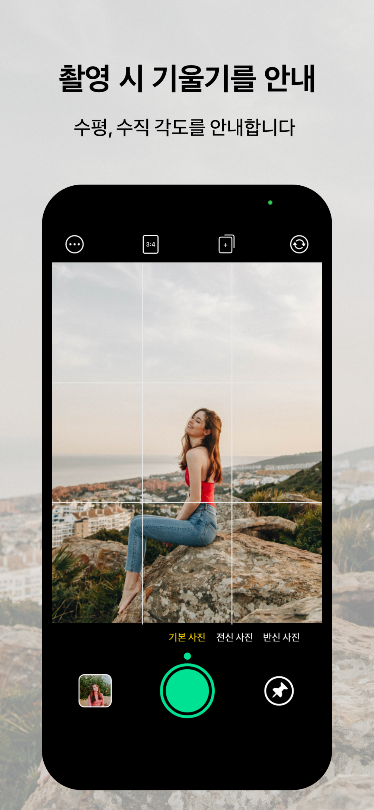
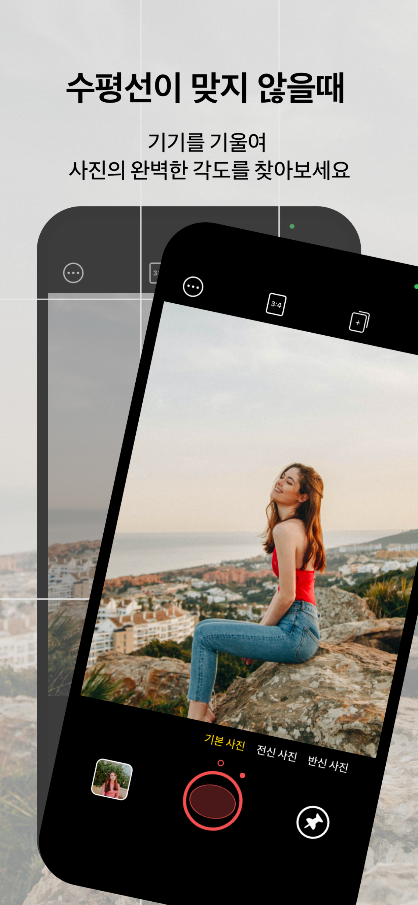
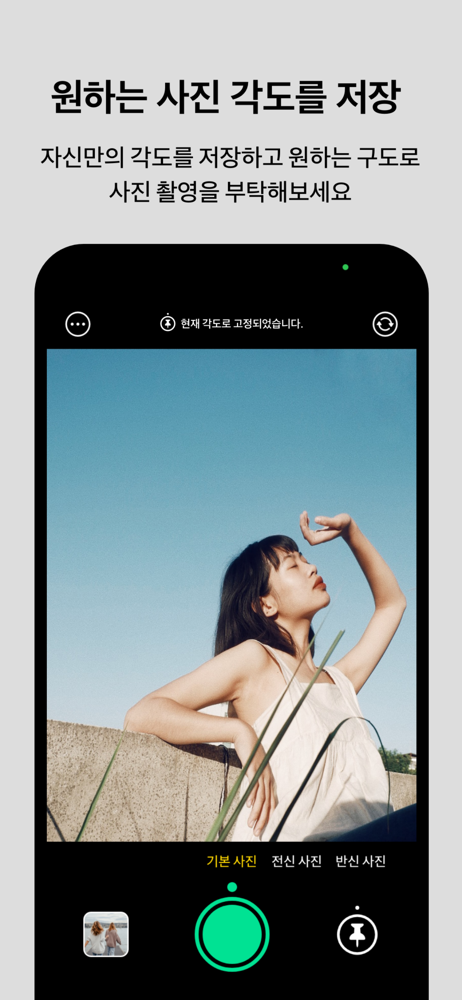
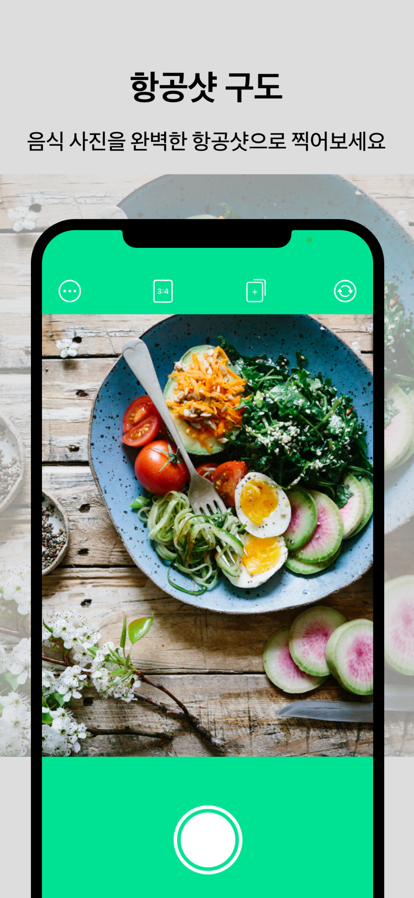
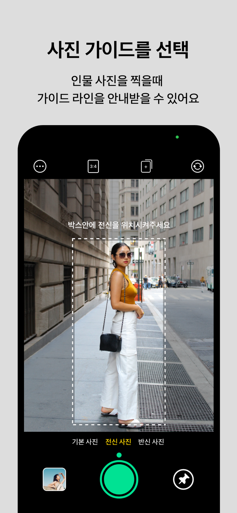

# GAK
완벽한 사진을 촬영하고 싶은 사람들을 위해  
완벽한 수평과 수직을 안내해주는 카메라 앱 GAK! 
완벽한 항공샷을 안내해주는 카메라 앱 GAK!

[GAK 이런 분들에게 추천해요!]

- 여자친구에게 사진 못 찍는다고 잔소리 듣는 남자친구들 
 GAK을 활용해서 칭찬 들어보세요!

- 사진 못 찍는 남자친구 때문에 답답하신 여자친구분들! 
   GAK의 각도 고정기능을 활용해서 남자친구에게 원하는 구도와 각도를 훈련 시키세요!

- 완벽하게 음식 사진을 찍고 싶은 분들! 항공샷 모드를 활용하세요. 
   렌즈를 음식과 수평 방향으로 기울이기만 해도 모드가 변경돼요!

 ## How To Use GAK
     
 

## Bug Report
앱에 문제를 발견하시면 Issue를 추가해서 도움을 주실 수 있습니다.
 
## Team

### 김동현
Dev, "완벽한 사진에 집착하는 개발자입니다."

### 서인재
UX, "누구나 쉽게 이용가능한 앱을 만들고싶습니다!!!" 

### 김혜정
Designer, "사용자에게 좋은 경험을 주는 앱을 만들겠습니다!"
